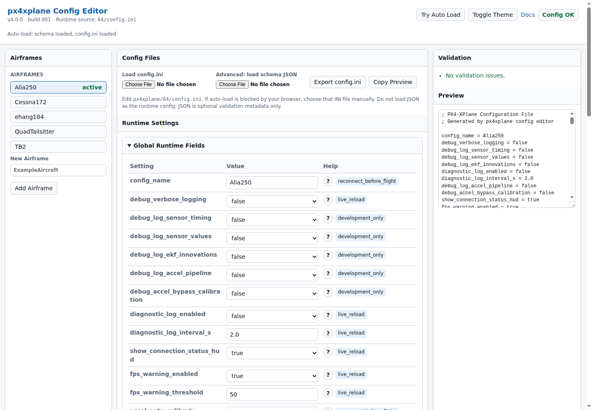

# PX4-XPlane

[](https://github.com/alireza787b/px4xplane/actions/workflows/build.yml)
[](https://github.com/alireza787b/px4xplane/releases)
[](LICENSE)
[](https://github.com/alireza787b/px4xplane)

PX4-XPlane connects PX4 SITL to X-Plane. It lets PX4 fly X-Plane aircraft by sending actuator commands to writable X-Plane datarefs and returning simulated sensors such as IMU, GPS, barometer, magnetometer, airspeed, and ground truth.

The current package is `v4.0.0`. It includes the plugin, a browser config editor, reference PX4 airframes, and tested examples for Cessna 172, TB2, Ehang 184, Alia 250, and QuadTailsitter.

## Media

The v4 walkthrough videos will be recorded after the PX4 integration lands in
the official repository. Older videos are still useful as a project history
archive and show how the integration evolved:

[](https://www.youtube.com/watch?v=eZJpRHFgx6g&list=PLVZvZdBQdm_4RepbwUZaccwH0iQvHtMBh&pp=sAgC)

[Watch the px4xplane video archive and future playlist](https://www.youtube.com/watch?v=eZJpRHFgx6g&list=PLVZvZdBQdm_4RepbwUZaccwH0iQvHtMBh&pp=sAgC)

## Quick Start

1. Download the plugin package for your OS from [Releases](https://github.com/alireza787b/px4xplane/releases).
2. Copy the extracted `px4xplane` folder to `X-Plane/Resources/plugins/`.
3. Start X-Plane and load the matching aircraft.
4. Start PX4 SITL with the helper:

```bash
cd ~
curl -O https://raw.githubusercontent.com/alireza787b/px4xplane/master/setup/setup_px4_sitl.sh
bash setup_px4_sitl.sh
```

After the first setup, run:

```bash
px4xplane
```

The launcher lets you select:

```text
xplane_cessna172
xplane_tb2
xplane_ehang184
xplane_alia250
xplane_qtailsitter
```

Until the PX4 PR is merged, the launcher uses the maintained `alireza787b/PX4-Autopilot-Me` branch `px4xplane-sitl`. After merge, the workflow will move to the official PX4 repository.

## Windows, WSL, Docker, and Firewalls

PX4 connects to X-Plane on TCP port `4560`.

If PX4 and X-Plane are on the same native Linux or macOS machine, no extra network setup is usually needed. If PX4 runs in WSL2, Docker, or another computer, set `PX4_SIM_HOSTNAME` in the PX4/SITL shell to the IP address of the machine running X-Plane:

```bash
export PX4_SIM_HOSTNAME=172.21.144.1
```

Also allow inbound TCP `4560` on the X-Plane host firewall. The setup helper can auto-detect the Windows host IP for common WSL2 setups, and `px4xplane --reset-ip` re-prompts if a wrong IP was saved.

## Config Editor

The plugin reads one runtime config file:

```text
px4xplane/64/config.ini
```

Open the editor from:

```text
Plugins > px4xplane > Advanced > Open Config Editor
```

or open:

```text
px4xplane/docs/config-editor.html
```

If your browser blocks auto-load, choose `px4xplane/64/config.ini` manually. The JSON schema is only editor/validator metadata, not a second runtime config.



## Custom Airframes

The included examples are ready-to-test PX4 targets. They are not a hard limit. A new X-Plane aircraft or vehicle model can be integrated when PX4 has a matching SITL-capable control path and px4xplane can map the needed actuator outputs to writable X-Plane datarefs.

Start here:

- [Custom airframe guide](docs/custom-airframe-config.md)
- [Config schema](docs/developer/config-schema.md)
- [X-Plane datarefs](https://developer.x-plane.com/datarefs/)
- [Plane Maker manual](https://developer.x-plane.com/manuals/planemaker/index.html)

## Docs

- [Build guide](docs/BUILD.md)
- [Developer guide](docs/DEVELOPER.md)
- [Documentation index](docs/index.md)
- [Alia test card](docs/ALIA_XPLANE12_TEST.md)
- [Ehang test card](docs/EHANG184_XPLANE12_TEST.md)
- [QuadTailsitter test card](docs/QUADTAILSITTER_XPLANE12_TEST.md)
- [Cessna 172 test card](docs/CESSNA172_XPLANE12_TEST.md)
- [TB2 test card](docs/TB2_XPLANE12_TEST.md)

New v4 walkthrough videos will be published after the PX4 integration lands in the official repository.

## Build from Source

```bash
git clone --recursive https://github.com/alireza787b/px4xplane.git
cd px4xplane
cmake -B build -DCMAKE_BUILD_TYPE=Release
cmake --build build --config Release
```

Build output is under `build/<platform>/Release/px4xplane/`.

## Maintenance

```bash
px4xplane --sync         # sync PX4 fork branch, submodules, and saved SITL params
px4xplane --reset-ip     # re-enter the X-Plane host IP
px4xplane --reset-config # clear saved launcher settings
px4xplane --repair       # rerun setup and sync path
```

Before sharing a custom config:

```bash
python3 tools/validate_config.py config/config.ini
```

## License

MIT. See [LICENSE](LICENSE).
